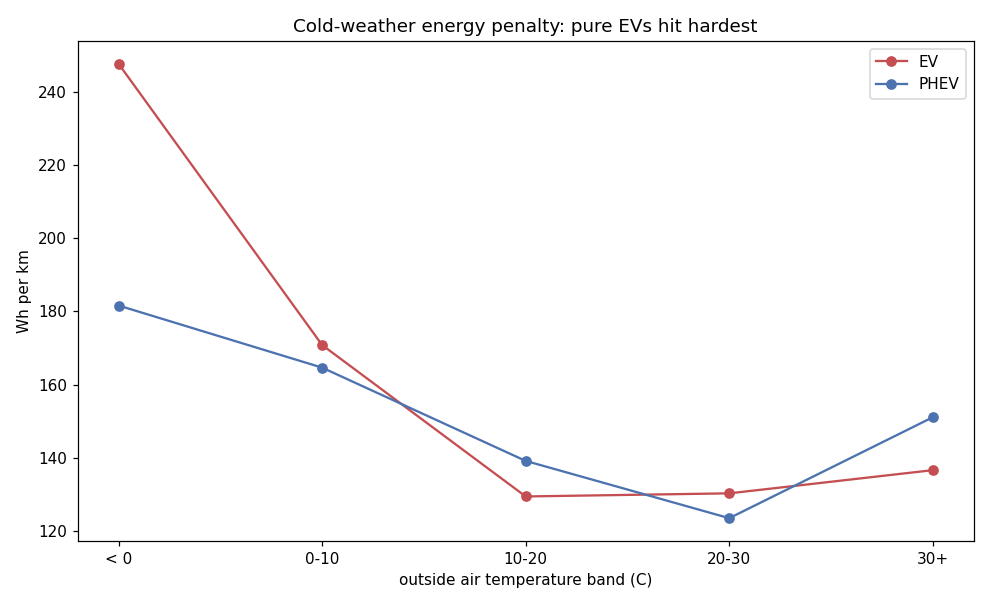
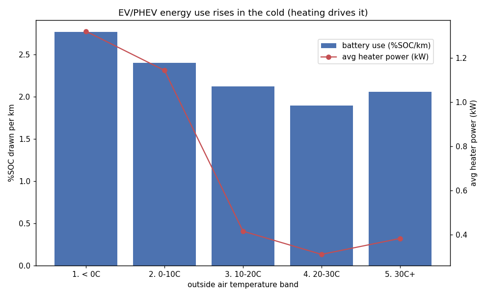
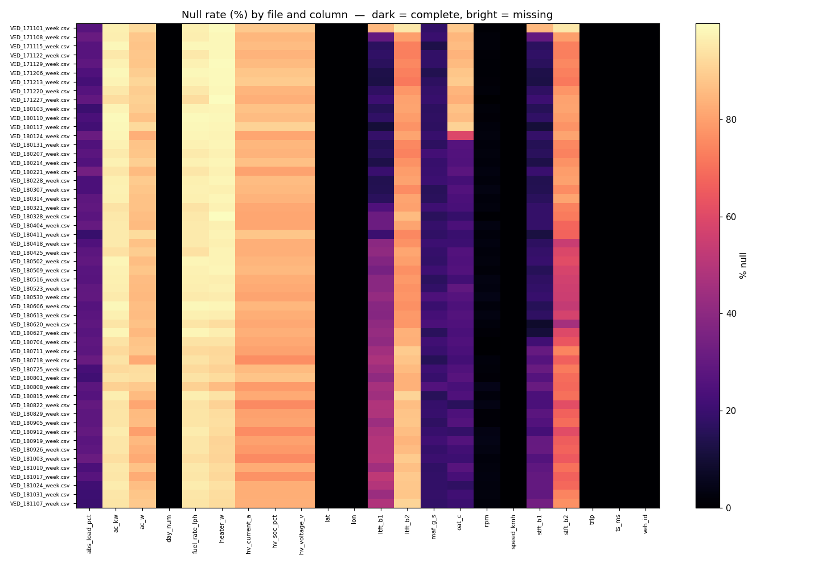

# VED Telemetry — Insights

*Pipeline: 22,436,808 raw pings · 54 weekly files · 384 vehicles · Nov 2017 – Nov 2018. Built bronze → silver → gold on DuckDB.*

## Headline: cold weather is a ~35% range tax (worse for pure EVs)

On the 27 battery-capable vehicles (24 PHEV + 3 EV), I integrated pack power
(∫ V·I dt) per rebuilt session and divided by haversine distance. Efficiency
degrades steadily as it gets colder, and the two independent metrics agree:

| Temp band | Sessions | %SOC drawn / km | Energy (Wh/km) |
|-----------|---------:|----------------:|---------------:|
| **< 0 °C**   | 448  | **2.77** | **192** |
| 0–10 °C      | 1040 | 2.40 | 166 |
| 10–20 °C     | 639  | 2.12 | 138 |
| **20–30 °C** | 998  | **1.90** | **124** |
| 30 °C+       | 159  | 2.06 | 149 |

**Below 0 °C the fleet uses +54% more energy per km than at the 20–30 °C
optimum (192 vs 124 Wh/km) — roughly a 35% range loss.** It splits sharply by
drivetrain: **pure EVs take +90% (248 vs 131 Wh/km, ≈ −47% range)** while PHEVs
take +47% — PHEVs can borrow waste heat from the engine, EVs can't.

**Why:** cabin heating, not the battery. Average heater draw is **1.32 kW below
0 °C vs 0.31 kW at 20–30 °C (~4×)**. The slight uptick at 30 °C+ is the mirror
image — A/C climbs to 1.84 kW. HVAC, not propulsion, is the swing factor.

*Product read:* range anxiety and "my range dropped" complaints will cluster in
winter and are largely an HVAC-energy problem — addressable with pre-conditioning
while plugged in, heat-pump heating, and temperature-aware range estimates.

## Top 3 data-quality problems found

Scored from a config-driven scorecard (`output/pipeline_health.csv`, one row per
file × check). Overall score **99.98/100** — but the score deliberately weights
*physical validity*, and the interesting problems are in shape, not key integrity
(duplicate keys = 0 and out-of-order timestamps = 0 across all 54 files).

1. **Impossible sensor spikes.** `Absolute Load` reaches **22,463%** (29,219 rows
   above 100%); SOC occasionally leaves 0–100. Caught by the config-driven range
   checks and null-ed out before silver so they can't poison aggregates.
2. **Long, *structured* sensor dropouts.** Missingness isn't random — it arrives
   in runs. Longest consecutive-NULL stretch is **10,813 pings for SOC and OAT**
   (4,729 for RPM). Any gap-filling has to be run-length-aware; you cannot
   forward-fill across a 10k-ping outage.
3. **Thin coverage of the signals that matter.** Battery telemetry (V/I/SOC) only
   exists on the 27 PHEV/EV vehicles, so ~83% of rows are NULL for those columns
   and the entire energy insight rests on a minority slice. This is expected given
   the fleet mix, but it means *widening instrumentation coverage* is the highest-
   leverage data improvement, not cleaning the rows we already have.

## How this maps to staging scooter telemetry (bronze → silver → gold)

The same three-layer shape transfers directly to an EV-scooter backend:

- **Bronze** — land every scooter's raw OBD/BMS pings (pack V/I/SOC, GPS, speed,
  motor temp) into one table with `source_file`/ingest provenance, and run this
  exact observability layer per firmware version / region: null & range checks,
  dropout run-lengths, dup & ordering on the natural key, rolled into one
  `pipeline_health` scorecard. This is what lets you *trust* data you're moving at
  fleet scale before anyone builds on it.
- **Silver** — sessionize raw pings into rides with gaps-and-islands (a time-gap
  threshold), compute haversine distance and moving-vs-idle time, and validate the
  rebuilt rides against any app-recorded trip boundaries.
- **Gold** — per-ride energy (∫ V·I dt), Wh/km efficiency and SOC drain, then the
  same temperature analysis to surface cold-weather range loss, flag battery
  degradation, and rank inefficient routes/riders.

The heavy lifting is SQL (window functions, `QUALIFY` dedup, gaps-and-islands,
config-driven checks); Python only orchestrates and plots.
