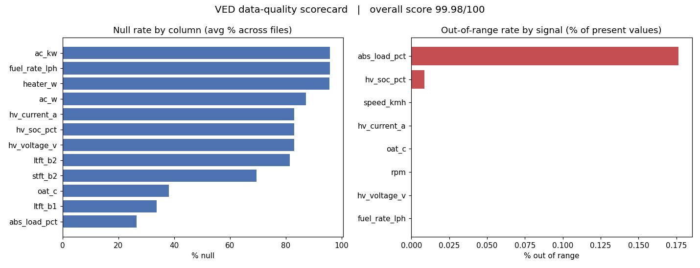

# VED Telemetry Pipeline — bronze → silver → gold on DuckDB

A SQL-first analytics pipeline over the **Vehicle Energy Dataset (VED)**: ~22.4 million
real OBD-II telemetry pings from 383 vehicles over a year, moved from 54 raw weekly CSVs
into a clean, queryable warehouse with a built-in data-quality observability layer.

**Headline finding:** below 0 °C the EV/PHEV fleet draws **+54 % more energy per km**
(192 vs 124 Wh/km) than at the 20–30 °C optimum — roughly a **35 % cold-weather range
loss**, and up to **+90 % for pure EVs**. The driver is cabin heating (~1.3 kW vs ~0.3 kW),
not the battery itself. Full writeup in [INSIGHTS.md](INSIGHTS.md).

## Architecture

```
raw CSVs → bronze (typed landing) → dq (quality scorecard) → silver (sessionised trips)
         → gold (energy & efficiency) → plots / CSV
```

| Layer | File | What it does |
|---|---|---|
| Bronze | [sql/bronze.sql](sql/bronze.sql) | Ingest 54 weekly CSVs into one typed table; `NaN`→NULL, `TRY_CAST`, file provenance, malformed-line quarantine |
| DQ | [sql/dq_checks.sql](sql/dq_checks.sql) | Config-driven scorecard: null / physical-range / duplicate-key / out-of-order / sensor-dropout-run checks |
| Silver | [sql/silver_sessionize.sql](sql/silver_sessionize.sql) | Rebuild trips with gaps-and-islands; haversine distance, moving vs idle, validation against the recorded Trip |
| Gold | [sql/gold_battery.sql](sql/gold_battery.sql) | Per-session energy (∫ V·I dt), Wh/km & %SOC/km efficiency, efficiency-vs-temperature |

The data-quality framework is the centerpiece. Physical-range rules live in
[config/dq_rules.csv](config/dq_rules.csv) — adding a check is one line — and everything
rolls into one long/tidy `pipeline_health` table (one row per file × check) plus a single
overall score (**99.98 / 100**).

## Tech stack
Python + DuckDB. All transformation logic is **SQL** (window functions, `QUALIFY`,
gaps-and-islands, `UNPIVOT`, conditional aggregation); Python only orchestrates the SQL
files and renders plots.

## Run it
```bash
pip install -r requirements.txt
# place the VED data as shown under "Data" below, then:
python main.py             # full run, all 54 files (~4 min, ~22.4M rows)
python main.py --sample 3  # quick dev run on the first 3 files
python main.py --layer dq  # re-run a single layer against the existing warehouse
```
Outputs land in `output/`: `pipeline_health.csv`, `efficiency_by_temp.csv`, and 9 plots
in `output/plots/`.

## Data
Source: the public **Vehicle Energy Dataset (VED)** — real OBD-II logs from 383 vehicles in
Ann Arbor, MI (Nov 2017 – Nov 2018). The raw files (~3 GB) are **not committed**; download
them and arrange as:
```
VED_DynamicData_Part1/VED_*_week.csv   (22 weekly files)
VED_DynamicData_Part2/VED_*_week.csv   (32 weekly files)
VED_Static_Data_ICE&HEV.xlsx           (357 ICE/HEV vehicles)
VED_Static_Data_PHEV&EV.xlsx           (27 PHEV/EV vehicles)
```

## Selected visuals
Pure EVs take the hardest cold-weather hit:




## Repo layout
```
sql/         bronze · dq_checks · silver_sessionize · gold_battery
config/      dq_rules.csv  (the DQ rule config)
main.py      end-to-end orchestrator
output/      scorecard CSV + 9 plots (generated)
INSIGHTS.md  one-page findings
```
